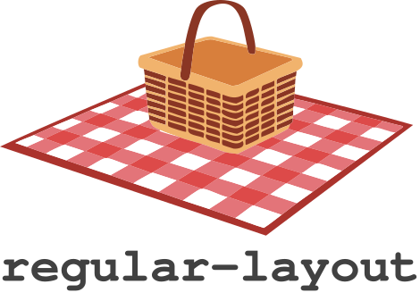
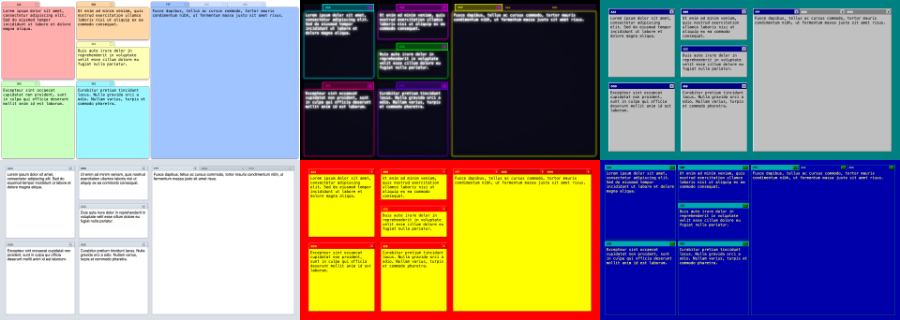

<br />
<a href="https://perspective-dev.github.io">
<p align="center">
<picture>
<source media="(prefers-color-scheme: dark)" srcset="./logo.svg">

</picture>
<br/>
<br/>
<a href="https://github.com/texodus/regular-layout/actions"></a>
<a href="https://www.npmjs.com/package/regular-layout"></a>
<a href="https://bundlephobia.com/package/regular-layout"></a>
<!-- <a href="https://www.npmjs.com/package/regular-table"></a> -->
<br/>
<br/>
</p>


A library for resizable & repositionable panel layouts.

- Zero depedencies, pure TypeScript, tiny.
- Implemented as a [Web Component](https://developer.mozilla.org/en-US/docs/Web/API/Web_components),
  interoperable with any framework.
- Zero DOM mutation at runtime, implemented entirely by generating using
[CSS `grid`](https://developer.mozilla.org/en-US/docs/Web/CSS/Guides/Grid_layout) rules.
- Supports arbitrary theming via CSS [variables](https://developer.mozilla.org/en-US/docs/Web/CSS/Guides/Cascading_variables/Using_custom_properties) and [`::part`](https://developer.mozilla.org/en-US/docs/Web/CSS/Reference/Selectors/::part).
- Supports async-aware container rendering for smooth animations even when rendering ovvurs over an event loop boundary.
- Covered in bees.

## Demo

<a href="https://texodus.github.io/regular-layout/"></a>

## Installation

```bash
npm install regular-layout
```

## Quick Start

Import the library and add `<regular-layout>` to your HTML. Children are
matched to layout slots by their `name` attribute.

```html
<script type="module" src="regular-layout/dist/index.js"></script>

<regular-layout>
    <div name="main">Main content</div>
    <div name="sidebar">Sidebar content</div>
</regular-layout>
```

For draggable, tabbed panels, use `<regular-layout-frame>`:

```html
<regular-layout>
    <regular-layout-frame name="main">
        Main content
    </regular-layout-frame>
    <regular-layout-frame name="sidebar">
        Sidebar content
    </regular-layout-frame>
</regular-layout>
```

Panels must be added and remove programmatically (e.g they are not 
auto-registered):

```javascript
const layout = document.querySelector("regular-layout");

// This adds the panel definition to the layout (and makes it visible via CSS),
// but does not mutat the DOM.
layout.insertPanel("main");
layout.insertPanel("sidebar");

// This removes the panel from the layout (and hides it via CSS) but does not
// mutate the DOM.
layout.removePanel("sidebar");
```

## Save/Restore

Layout state serializes to a JSON tree of splits and tabs, which can be
persisted and restored:

```javascript
const state = layout.save();
localStorage.setItem("layout", JSON.stringify(state));

// Later...
layout.restore(JSON.parse(localStorage.getItem("layout")));
```

`restore()` dispatches a cancelable `regular-layout-resize-before` event before
applying the new state. Call `preventDefault()` to suspend the update, then
`layout.resumeResize()` when ready:

```javascript
layout.addEventListener("regular-layout-resize-before", (event) => {
    event.preventDefault();
    // ... prepare for resize ...
    layout.resumeResize();
});
```

The `restore()` API can also be used as an alternative to 
`insertPanel`/`removePanel` for initializing a `<regular-layout>`.

## Theming

Themes are plain CSS files that style the layout and its `::part()` selectors,
scoped by a class on `<regular-layout>`. Apply a theme by adding its stylesheet
and setting the class:

```html
<link rel="stylesheet" href="regular-layout/themes/chicago.css">

<regular-layout class="chicago">
    ...
</regular-layout>
```

`<regular-layout-frame>` exposes these CSS parts:

| Part | Description |
|------|-------------|
| `titlebar` | Tab bar container |
| `tab` | Individual tab |
| `active-tab` | Currently selected tab |
| `close` | Close button |
| `active-close` | Close button on the active tab |
| `container` | Content area |

```css
regular-layout.mytheme regular-layout-frame::part(titlebar) {
    background: #333;
}

regular-layout.mytheme regular-layout-frame::part(active-tab) {
    background: #fff;
    color: #000;
}
```

See [the example `themes/`](./themes) directory for examples of how to write a
complete theme for `<regular-layout>` and `regular-layout-frame>`.

## Events

| Event | Detail | Cancelable | Description |
|-------|--------|------------|-------------|
| `regular-layout-resize-before` | `{ calculatePresizePaths() }` | Yes | Fired before any layout change. Cancel to suspend until `resumeResize()`. |
| `regular-layout-update` | `Layout` | No | Fired after layout state is updated. |

```javascript
layout.addEventListener("regular-layout-update", (event) => {
    console.log("New layout:", event.detail);
});
```
